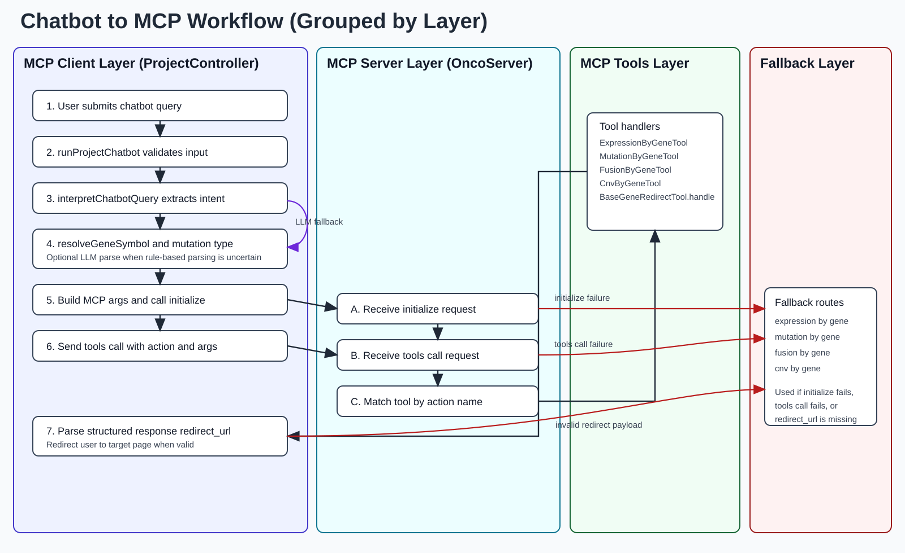
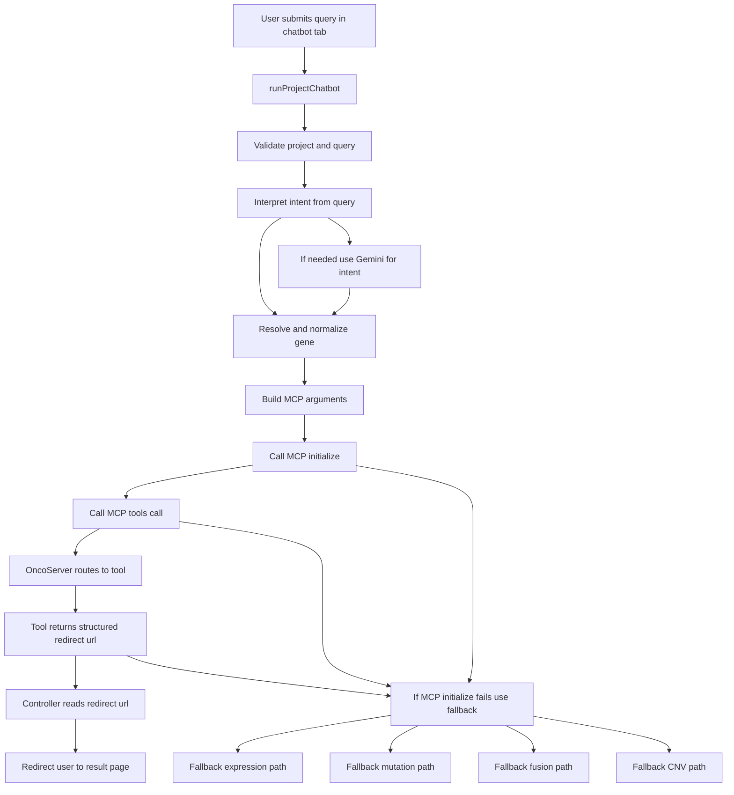

# Chatbot to MCP Workflow

This document describes how a user query is interpreted and routed through the project chatbot, MCP server, and tool handlers.

## End-to-End Flow

SVG version: [chatbot-mcp-flow.svg](chatbot-mcp-flow.svg)

## Notes

- MCP invocation is attempted first for supported actions.
- Legacy fallback behavior is preserved if MCP initialize/tool call fails.
- Gene symbol correction uses exact match first, then fuzzy matching.
- Gemini parsing is used only when rule-based intent extraction does not match.
